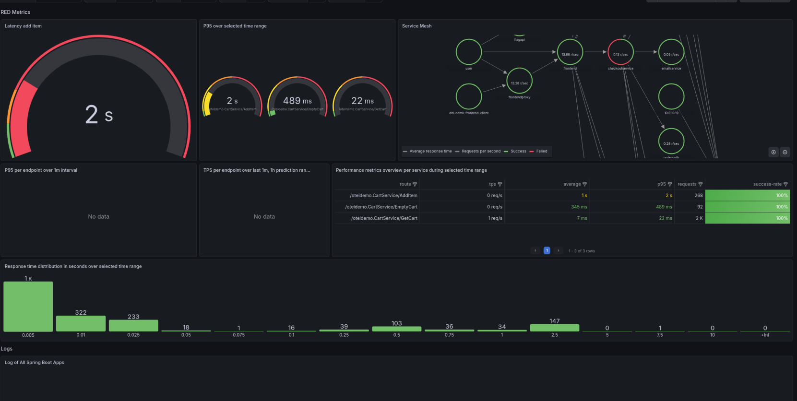

# Solution: Challenge 2 — Service Level Monitoring

---

## Task 1: Find a suggested dashboard

### Step 1 — Open the data source

1. Go to **Connections** > **Data Sources**
2. Select your Prometheus data source (format: `grafanacloud-<instance-id>-prom`)

### Step 2 — Browse suggested dashboards

1. Click **Build dashboards** > **From suggestions**
2. In the suggestions modal, search for **`OpenTelemetry for HTTP Services`** — the search is case sensitive, use this exact casing
3. Select **OpenTelemetry for HTTP Services**
4. Click **View dashboard**

### Step 3 — Map data sources

When prompted, map the data sources:
- **Loki:** `grafanacloud-<instance-id>-logs`
- **Tempo:** `grafanacloud-<instance-id>-traces`

### Step 4 — Select the service

1. Use the `service_name` dashboard variable
2. Select **cartservice**

### Step 5 — Save

If the dashboard is showing data, click **Save dashboard** — you'll modify this version in Task 2.

---

## Task 2: Make latency visible

### Step 1 — Identify latency signals

Locate panels that show:
- **P95 latency** — the worst wait time experienced by 95 out of 100 shoppers. Ignore the 5 slowest experiences, and this is the maximum.
- **P99 latency** — the worst wait time experienced by 99 out of 100 shoppers. Ignore only the single slowest experience, and this is the maximum.

Averages hide the slow ones. Percentiles don't.

These are your key indicators of performance issues.

### Step 2 — Make latency visible at a glance

1. Edit the main latency panel
2. Update the title: e.g. `P95 Latency (ms)`
3. Ensure the unit is set to **milliseconds (ms)**

### Step 3 — Apply meaningful thresholds

In your team: latency >= 2 seconds is a problem.

1. In the panel editor, go to **Standard options** and set:
   - **Min:** `0`
   - **Max:** `10`

   > **This is required.** Without both min and max set, the gauge will not display threshold colors even if thresholds are configured.

2. Under **Thresholds**, set:
   - Green: < 1s
   - Yellow: 1s – 2s
   - Red: >= 2s

3. Make sure **Thresholds mode** is set to **Absolute** (not Percentage).

4. If the gauge shows as a half-arc instead of a full circle, go to **Gauge > Style** and select **Full** (complete arc).

### Step 4 — Reorganize the dashboard

1. Move latency panels to the **top** of the dashboard
2. Group related panels together

### Step 5 (optional) — Improve structure

Organize panels into tabs or sections:
- **Overview** — key health signals at the top
- **Latency** — detailed latency breakdown
- **Errors / Logs** — error rates, log panels

### Result

The dashboard now immediately shows whether latency is healthy (green) or problematic (red). No more guessing — a glance tells you if adding plushes to the cart is fast or slow.

**Example result** — your dashboard may look slightly different depending on how you reorganize it:

