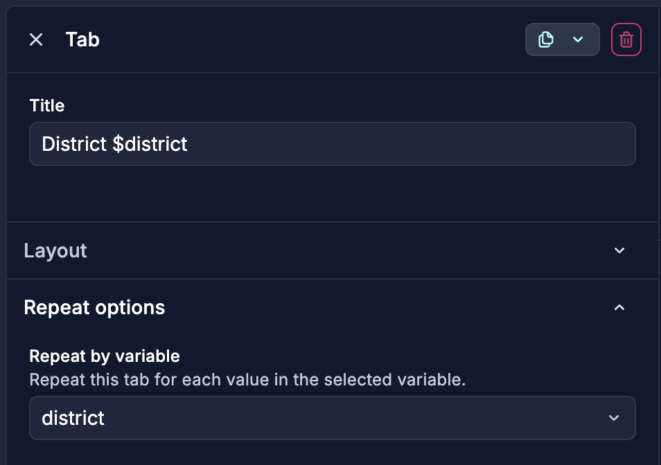
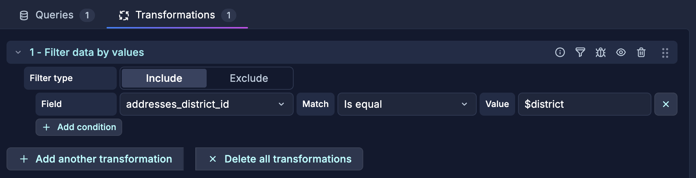

# Hands-on #1: Barcelona Public WiFis

**Section:** From data to insight: static data · **Facilitator:** Yaëlle
**Data source:** Infinity · **Duration:** 30 min

---

## What you will build

A dashboard showing Barcelona's public Wi-Fi hotspots — a map of locations and a count per district. You will learn the anatomy of a dashboard, how to connect to a public API with Infinity, and how to make your dashboard interactive with template variables, tabs, and repeats.

**Expected outcome:** A saved dashboard with a GeoMap panel, a Stat count panel, tabs for overview and district view, and a district filter variable.

---

## Anatomy of a Dashboard

Before building, take a moment to recognize the parts you will be using:

| Element | What it does |
|---|---|
| **Panels / grid** | Individual visualizations arranged on a canvas |
| **Variables** | Dropdowns at the top that filter the whole dashboard |
| **Time range picker** | Controls the time window for all panels |
| **Data (auto)refresh** | Keeps panels updated on a schedule |
| **Collapsible rows** | Group panels into sections |
| **Tabs** | Organize panels into separate views |
| **Outline** | Shows the structure of the dashboard at a glance |

---

## Anatomy of a Panel (edit mode)

When you open a panel in edit mode, there are key areas:

1. **Queries** — where you define what data to fetch
2. **Transforms** — post-process the data before rendering
3. **Render area** — the live preview of your visualization
4. **Options & Overrides** — panel options, field config, and per-field overrides

---

## Step 1: GeoMap — where are the hotspots?

### 1. Create a new blank dashboard

Go to **Dashboards** > **New** > **New Dashboard**. Save it immediately in your personal folder (`@yourname`) with a meaningful name, e.g. `Barcelona Public WiFis`.

### 2. Add a new panel

Click **Add** > **Visualization**.

- **Data source:** Infinity
- Use the **Saved query**: select the Barcelona WiFi saved query

<details>
<summary>Alternative: manual query setup</summary>

If you prefer to set up the query manually:

- **URL:**
  ```
  https://opendata-ajuntament.barcelona.cat/data/api/action/datastore_search?resource_id=a118d6f8-b33d-4091-94ae-c14b8bb0ecbb
  ```
- **Parser:** Backend (JQ)
- **Parsing options:**
  - Rows/Root: `.result.records[]`
  - Columns:

  | Selector | Alias | Format |
  |---|---|---|
  | `geo_epgs_4326_lat` | `latitude` | String |
  | `geo_epgs_4326_lon` | `longitude` | String |
  | `name` | `name` | String |
  | `addresses_district_id` | `addresses_district_id` | String |

</details>

### 3. Select the GeoMap visualization

Switch the visualization type (top right) to **Geomap**.

Grafana will plot a dot on the map for each record using the `latitude` and `longitude` columns.

**Checkpoint:** Can you see dots on a map of Barcelona?

---

## Step 2: Stat panel — how many hotspots?

### 1. Add another panel

Click **Add** > **Visualization**. Use the **exact same query** as Step 1 (same saved query or same manual setup).

### 2. Select the Stat visualization

Switch to **Stat**.

- Under **Value options**, set **Show** to `Calculate`
- Set **Calculation** to `Count`
- Set **Fields** to `name`

### 3. Play around with options

Try changing colors, adding a unit label, or toggling the graph sparkline.

**Checkpoint:** Does the number match the count of dots on your map?

---

## Layouts

You can organise your panels in groups using **Auto Layout** or **Custom Layout**. Auto Layout arranges panels automatically; Custom Layout gives you full control over positioning.

---

## Template Variables — make it interactive

Variables let viewers filter the dashboard without editing it. Grafana supports several types:

| Type | What it does |
|---|---|
| **Query** | Dynamic options from a query |
| **Custom** | Static options you define |
| **Textbox** | User input — free text |
| **Switch** | On/Off toggle |

**Advanced types:**

| Type | What it does |
|---|---|
| **Constant** | Hidden, set once — great for maintenance |
| **Data source** | Choose data source dynamically |
| **Interval** | Time-based selection |
| **Ad hoc filters** | Advanced filtering (Prometheus & Loki) |

---

## Repeats

You can set a panel to **repeat** for every value of a multi-select template variable. You can also set a whole **tab** or **row** to repeat.

---

## Transformations

Transformations let you shape your data after the query returns:

- **Filter** — remove portions of query results
- **Organize fields** — reorder, rename, hide fields
- **Join** — combine multiple queries
- **Calculate** — create new fields from calculations
- And much more!

---

## Step 3: Make it interactive

### 1. Add a Custom variable

Go to **Dashboard settings** > **Variables** > **Add variable**.

- **Type:** Custom
- **Name:** `district`
- **Custom options:** `1, 2, 3, 4, 5, 6, 7, 8, 9`
- Allow **multi-value**

Apply and go back to the dashboard. You should see a **District** dropdown at the top.

### 2. Group your existing panels into a tab

Your two panels (GeoMap and Stat) should be organized into a tab. This will be the overview — showing all WiFi hotspots regardless of district.

### 3. Duplicate the tab

Create a copy of the tab and call it **"District $district"**.

### 4. Set the tab on repeat

Select the new tab and set it to **repeat by variable** `district`. Each selected district value will generate its own tab automatically.


### 5. Add a filter transformation

In the **duplicated tab**, open each panel in edit mode and go to the **Transform data** tab.

- Add transformation: **Filter data by values**
- **Filter type:** Include
- **Field:** `addresses_district_id`
- **Match:** Is equal
- **Value:** `$district`



Now when the viewer picks a district, the second tab shows only the hotspots in that district.

**Checkpoint:** Change the district dropdown — does the filtered tab update while the overview stays the same?

---

## Summary

You went through all 3 layers with real data:

| Layer | What happened |
|---|---|
| **Collect** | Barcelona Open Data API publishes Wi-Fi hotspot records |
| **Connect** | Infinity data source fetched and parsed the JSON |
| **Visualize** | GeoMap + Stat panels + a variable for interactivity |

What you learnt in this section:

1. **Tabs** to organise views
2. **Auto & custom layout** options
3. **Saved queries** to rely on organisational knowledge
4. A few visualisation types: **Geomap** and **Stat**
5. A **custom variable** to make the dashboard interactive
6. **Transformations** to filter the data based on variable selected
7. **Repeats** to generate panels/tabs dynamically

---

> **No peeking!** A solution dashboard JSON is available for reference, but try to complete the exercise on your own first.
> When you're done: [View solution dashboard](./barcelona-wifis-solution.json)